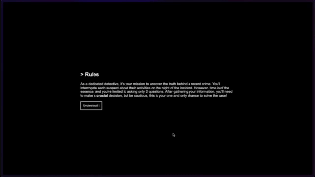

# FindTheAI

> A simple web detective game using LLM for immersive experience.



## Overview

*Find the AI* is an exciting detective game where you must uncover the truth behind a mysterious crime. As a detective, you'll interrogate suspects to gather information, but time is of the essence, and you're limited to asking only two questions. After collecting all the necessary details, you must make a final decision about the culprit. The game also features customizable elements, allowing you to adjust the type of crime, the setting, the date, and the difficulty level, making each playthrough unique. Powered by AI running locally via Llama-cpp-wasm and the phi-2.Q3_K_M model, this game offers an immersive experience.

## Features

- **Customizable Party:** Adjust the type of crime, crime location, incident date, and difficulty for a fresh and engaging experience every time you play.
- **Dynamic AI-Powered Interactions:** The AI generates realistic responses from suspects, making each playthrough feel unique.
- **Local AI Model:** The game runs entirely on your local machine using [Llama-cpp-wasm](https://github.com/tangledgroup/llama-cpp-wasm) and the [phi-2.Q3_K_M](https://huggingface.co/TheBloke/phi-2-GGUF/blob/main/phi-2.Q3_K_M.gguf) model
- **Multiple Outcomes:** Your decisions determine the outcome of the game, offering multiple possibilities for how the case can unfold.

## How to Play

You can either use the [link](stantonik.github.io/FindTheAI/) of the site web hosted on GitHub or clone the repository and run the site locally. 

```bash
git clone https://github.com/stantonik/FindTheAI.git
cd FindTheAI
python server.py
```

Then go to this url "*localhost:8000*" on you browser.
